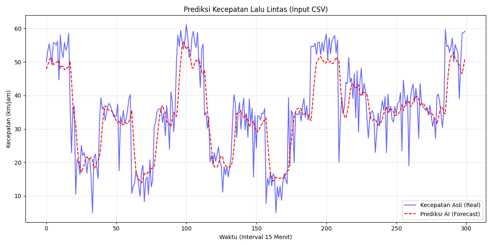

# 🚦 Prediksi Kepadatan Lalu Lintas Berbasis Kecerdasan Buatan LSTM


Sistem cerdas untuk memprediksi kecepatan rata-rata lalu lintas (km/jam) menggunakan algoritma *Deep Learning* **Long Short-Term Memory (LSTM)**. Sistem ini mempertimbangkan faktor historis, curah hujan, dan hari libur untuk memberikan estimasi kemacetan secara *real-time* melalui antarmuka web.

---

## 📊 Visualisasi & Hasil Eksperimen

Berikut adalah hasil analisis data lalu lintas dan performa prediksi model AI yang telah dikembangkan.

### 1. Sebaran Data Lalu Lintas (Traffic Analysis)
Grafik ini menunjukkan pola distribusi kecepatan kendaraan berdasarkan data historis/simulasi.


### 2. Hasil Prediksi AI vs Data Aktual
Grafik perbandingan antara kecepatan aktual (Biru) dan hasil prediksi model LSTM (Merah). Garis merah yang mengikuti pola biru menunjukkan model berhasil mempelajari tren kemacetan.


---

## 📂 Struktur Direktori

Pastikan struktur folder proyek Anda terlihat seperti ini agar sistem berjalan lancar:

```text
SistemPrediksiLalin/
│
├── backend/                   # Logika Python, AI, dan API Server
│   ├── app.py                 
│   ├── scripts/               
│   ├── datasets/              
│   └── models/
│       └── model_lalin.h5     
│
├── frontend/                  # Tampilan Antarmuka Web
│   ├── index.html             
│   └── img/                   
│       ├── hasil_prediksi_csv.png
│       └── traffic_analysis.png
│
└── README.md                  # Dokumentasi Proyek